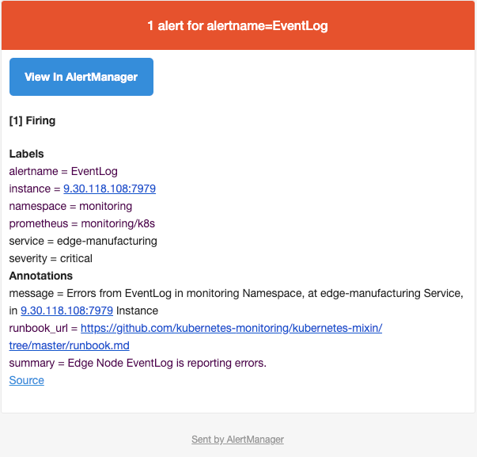

# Edge Monitoring
Cognitive Edge Monitoring with Prometheus Operator.

### Edge Node EventLog Rest API

Anax provides an Event Log rest API. For example, to list the event logs for the current or all registrations you can run:

`hzn eventlog list`


Event Log API source code is avaialble at:
[EventLog API](https://github.com/open-horizon/anax/blob/master/cli/eventlog/eventlog.go)

Here is an example of the information provided with `hzn eventlog list -l` command:

```
 {
    "record_id": "10",
    "timestamp": "2020-12-09 12:37:21 -0700 PDT",
    "severity": "error",
    "message": "Error starting containers: API error (500): driver failed programming external connectivity on endpoint 7996f592634d22c5583f74b0404cc77fd69969879fa5ec321e0cf2c70ef38043-acme-motion-detection-service-gpu (b3623ba8977d822fc4b0d47614e6cabb07b4f7d9b7004e5829aaa6440bb248d7): Bind for 0.0.0.0:9080 failed: port is already allocated",
    "event_code": "error_start_container",
    "source_type": "agreement",
    "event_source": {
      "agreement_id": "7996f592634d22c5583f74b0404cc77fd69969879fa5ec321e0cf2c70ef38043",
      "workload_to_run": {
        "url": "acme-motion-detection-service-gpu",
        "org": "ipcluster",
        "version": "1.0.0",
        "arch": "amd64"
      },
      "dependent_services": [],
      "consumer_id": "IBM/ipcluster-agbot",
      "agreement_protocol": "Basic"
    }
  }
```
Notice the `severity` and `message` content in the resulting JSON. This information will exported to Prometheus using a JSON exporter implementation.


## Overall workflow:

[1. Install JSON Exporter Edge Service](#preconditions)

[2. Install & Configure a k8s compatible cluster](#k3s)

[3. Deploy a Prometheus operator](#prometheus)

[4. Configure Custom Resource Definitions for Edge monitoring](#crds)

[5. Install a Grafana dashboard for Edge monitoring](#grafana)


## <a id=preconditions></a> 1. Install JSON Exporter edge service

The Prometheus development community has created a JSON Exporter to scrape remote JSON data by JSONPath. Source code is available at [https://github.com/prometheus-community/json_exporter](https://github.com/prometheus-community/json_exporter)

Install and configure the JSON Exporter edge service by following the steps provided at:

[edge-json-exporter repo](https://github.com/jiportilla/edge_json_exporter)

## <a id=k3s></a> 2. Install & configure a k8s compatible cluster

For example, to install k3s (rancher) complete the following steps:

### Install and configure a k3s edge cluster

K3s is a highly available, certified Kubernetes distribution designed for production workloads in unattended, resource-constrained, remote locations or inside IoT appliances.

This section provides a summary of how to install k3s (rancher), a lightweight and small kubernetes cluster, on Ubuntu 18.04. (For more detailed instructions, see the k3s documentation)

1. Either login as root or elevate to root with sudo -i
2. The full hostname of your machine must contain at least 2 dots. Check the full hostname:
	`hostname`
	hostname
	If the full hostname of your machine contains less than 2 dots, change the hostname:
	
	`hostnamectl set-hostname <your-new-hostname-with-2-dots>`

3. Install k3s with:

```
curl -sfL https://get.k3s.io | sh -

# Check for Ready node, 
#  takes maybe 30 seconds
 
k3s kubectl get node
```

Or other compatible k8s offerings.

Next, deploy **CoreOS** Prometheus Operator as described in the next section.

## <a id=prometheus></a> 3. Deploy a Prometheus operator and configure Custom Resource Definition

The Prometheus ecosystem consists of multiple components, many of which are optional.

### Prometheus Architecture

This diagram illustrates the architecture of Prometheus and some of its ecosystem components:


Details are available [here](https://prometheus.io/docs/introduction/overview/)

## Prometheus Operator

The Prometheus Operator introduces additional resources in Kubernetes to declare the desired state of a Prometheus and Alertmanager cluster as well as the Prometheus configuration. The resources it introduces are:

- Prometheus
- Alertmanager
- ServiceMonitor

The Prometheus resource declaratively describes the desired state of a Prometheus deployment, while a ServiceMonitor describes the set of targets to be monitored by Prometheus.


This repository collects Kubernetes manifests, Grafana dashboards, and Prometheus rules combined with documentation and scripts to provide easy to operate end-to-end Kubernetes cluster monitoring with Prometheus using the Prometheus Operator.

[https://github.com/prometheus-operator/prometheus-operator](https://github.com/prometheus-operator/prometheus-operator)
## Community Prometheus Operator

The Community Prometheus Operator for Kubernetes provides easy monitoring definitions for Kubernetes services and deployment and management of Prometheus instances.

The content of this Community Prometheus operator example is written in jsonnet and is an extension of the fantastic kube-prometheus project.


Components included in this package:

- The Prometheus Operator
- Highly available Prometheus
- Highly available Alertmanager
- Prometheus node-exporter
- kube-state-metrics
- CoreDNS
- Grafana
- SMTP relay to Gmail for Grafana notifications (optional)

Resources available at: 
[https://github.com/carlosedp/cluster-monitoring](https://github.com/carlosedp/cluster-monitoring)

## Community Prometheus Operator Quickstart deployment on K3S

To deploy the monitoring stack on your K3s cluster, there are four parameters that need to be configured in the vars.jsonnet file:

1. Set k3s.enabled to true.
2. Change your K3s master node IP(your VM or host IP) on k3s.master_ip parameter.
3. Edit suffixDomain to have your node IP with the .nip.io suffix or your cluster URL. This will be your ingress URL suffix.
4. Set traefikExporter enabled parameter to true to collect Traefik metrics and deploy dashboard.
After changing these values to deploy the stack, run:

```
$ make vendor
$ make
$ make deploy

# Or manually:

$ make vendor
$ make
$ kubectl apply -f manifests/setup/
$ kubectl apply -f manifests/
```

### Ingress
Now you can open the applications:

To list the created ingresses, run kubectl get ingress --all-namespaces, if you added your cluster IP or URL suffix in vars.jsonnet before rebuilding the manifests, the applications will be exposed on:

- Grafana on https://grafana.[your_node_ip].nip.io,
- Prometheus on https://prometheus.[your_node_ip].nip.io
- Alertmanager on https://alertmanager.[your_node_ip].nip.io

### Pre-reqs

The project requires json-bundler and the jsonnet compiler. The Makefile does the heavy-lifting of installing them. You need Go already installed:

```
git clone https://github.com/carlosedp/cluster-monitoring
cd cluster-monitoring
make vendor
# Change the jsonnet files...
make

```
After this, a new customized set of manifests is built into the manifests dir. To apply to your cluster, run:

`make deploy`

To uninstall run:

`make teardown`

## <a id=crds></a> 4. Configure CRDs for Edge monitoring

You should complete these steps before proceeding with the Community Prometheus Operator configuration:

1. Clone this git repository:

```bash
cd ~   # or wherever you want
git clone https://github.com/jiportilla/edge-metrics.git
cd ~/edge-metrics/
```


Using the resources provided in the `config` directory, create the following Custom Resource Definitions

- Service
- ServiceMonitor
- Endpoints


1. Update `config/external-servers.yaml` with the ip address(es) of the edge device(s) to be monitored

For example:

```yaml
apiVersion: v1
kind: Endpoints
metadata:
  name: edge-monitoring
  labels:
    k8s-app: edge-monitoring
subsets:
- addresses:
  - ip: [xxx.xxx.xxx.xxx]
  - ip: [yyy.yyy.yyy.yyy]
  ports:
  - name: metrics
    port: 7979
    protocol: TCP
```

Optionally, 

- update the `config/prometheus-rules.yaml` file with the desired conditions and severity using Prometheus PromQL:

```
  - name: edge.rules
    rules:
    - alert: EventLog
      annotations:
        message: 'Errors from EventLog in {{ $labels.namespace }} Namespace, at {{ $labels.service }} Service, in {{ $labels.instance }} Instance'
        runbook_url: https://github.com/kubernetes-monitoring/kubernetes-mixin/tree/master/runbook.md
        summary: Edge Node EventLog is reporting errors.
      expr: |
        count  by (namespace, service, instance) ( EventLog_error_info ) > 5
      for: 2m
      labels:
        severity: critical
        
```

- Apply the `prometheus-rules.yaml` file with `kubectl -n monitoring apply -f config/prometheus-rules.yaml`

**Note** Use any existing namespace, we recommend creating a `monitoring` namespace with

`k3s kubectl get namespaces`

`k3s kubectl create namespace monitoring`

- Verify the rules in Prometheus were update by opening the Alerts page at `http://prometheus.[your_node_ip].nip.io/alerts`


2. Next, add the CRDs listed above with:

`k3s kubectl -n monitoring apply -f config/external-servers.yaml`


Optionally, configure **AlertManager** to send **alerts** via email notifications.

Update the `config/alertmanager-secret.yaml` file with the email and route settings:

```
      email_configs:
      - to: <some-admin>@gmail.com
        from: <some-user>s@gmail.com
        smarthost: smtp.gmail.com:587
        auth_username: <some-user>@gmail.com
        auth_identity: <some-user>@gmail.com
        auth_password: ****
        headers:
          From: edge.node.alerts@gmail.com
          Subject: 'Edge EventLog alert'
```

 

Update **Alertmanager** configuration with:

`k3s kubectl -n monitoring apply -f config/alertmanager-secret.yaml`

Alert example

Email notification example



## <a id=grafana></a> 5. Install a Grafana dashboard for Edge monitoring

Grafana allows you to query, visualize, alert on and understand your metrics no matter where they are stored. Create, explore, and share dashboards with your team and foster a data driven culture:

- Visualize: Fast and flexible client side graphs with a multitude of options. Panel plugins for many different way to visualize metrics and logs.
- Dynamic Dashboards: Create dynamic & reusable dashboards with template variables that appear as dropdowns at the top of the dashboard.
- Explore Metrics: Explore your data through ad-hoc queries and dynamic drilldown. Split view and compare different time ranges, queries and data sources side by side.
- Explore Logs: Experience the magic of switching from metrics to logs with preserved label filters. Quickly search through all your logs or streaming them live.
- Alerting: Visually define alert rules for your most important metrics. Grafana will continuously evaluate and send notifications to systems like Slack, PagerDuty, VictorOps, OpsGenie.
- Mixed Data Sources: Mix different data sources in the same graph! You can specify a data source on a per-query basis. This works for even custom datasources.

[https://github.com/grafana/grafana](https://github.com/grafana/grafana)

### Import the Edge monitoring dashboard

A dashboard is a set of one or more panels organized and arranged into one or more rows. Grafana ships with a variety of Panels. Grafana makes it easy to construct the right queries, and customize the display properties so that you can create the perfect dashboard for your need. Each panel can interact with data from any configured Grafana Data Source (currently Graphite, Prometheus, Elasticsearch, InfluxDB, OpenTSDB, MySQL, PostgreSQL, Microsoft SQL Server and AWS Cloudwatch).

To import a dashboard click the + icon in the side menu, and then click Import.

From here you can upload a dashboard JSON file, paste a Grafana.com dashboard URL or paste dashboard JSON text directly into the text area.


Click on `Upload .json file` and upload the dashboard JSON file provide in `grafana/Edge-monitoring.json`


[https://grafana.com/docs/grafana/latest/reference/export_import/](https://grafana.com/docs/grafana/latest/reference/export_import/)

## Error Examples

Description of problem:

**Bind for 0.0.0.0:9080 failed: port is already allocated**

How reproducible:
After Edge Registration.

Actual Results:
The container fails to start.

Expected Results:
Container starts.

Additional info:

Tail of /var/log/upstart/docker.log (after restarting Docker):

Resolution:
Another docker container was still running in the background from a different project.

This can be fixed by running:

```
docker stop $(docker ps -a -q)
docker rm $(docker ps -a -q)
```

You need to make sure that the previous container you launched is killed, before launching a new one that uses the same port.

```
docker container ls
docker rm -f <container-name>
```

Also:

Execute a lsof command to find the process using the port (for me it was port 9090)

```
sudo lsof -i -P -n | grep 9090
```

Finally,  "kill" the process :

```
kill -9 <process id>
```
